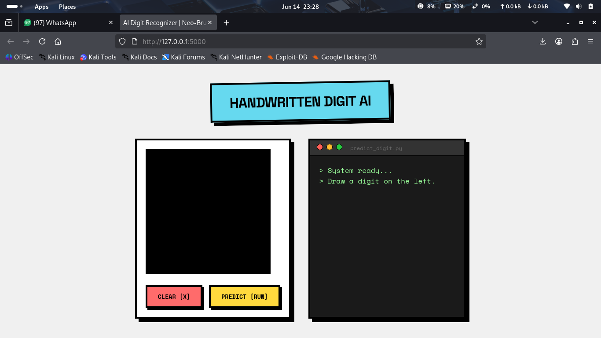

# ✍️ AI Handwritten Digit Recognizer

MNIST dataset par trained ek Convolutional Neural Network (CNN) jo aapke hand-drawn digits ko real-time mein identify karta hai. Iska UI **Neo-Brutalist** theme aur **Terminal Style** par based hai.



## 🛠️ Features

* **Interactive Canvas:** Mouse se digits draw karne ke liye drawing pad.
* **AI Prediction:** TensorFlow CNN backend jo high accuracy deta hai.
* **Terminal UI:** Live logs aur results dikhane ke liye retro terminal interface.
* **Auto-Train:** Agar model file nahi milti, toh ye apne aap train ho jata hai.

## 💻 Setup & Installation

### Windows Setup

```cmd
python -m venv ai_env
ai_env\Scripts\activate
pip install flask tensorflow numpy pillow
python main.py
```

### Linux (Kali/Ubuntu) Setup

```bash
python3 -m venv ai_env
source ai_env/bin/activate
pip install flask tensorflow numpy pillow
python main.py
```

## 🚀 How to Use

1. App run hone ke baad http://127.0.0.1:5000 par jayein.
2. Black canvas par koi bhi number (0-9) likhein.
3. **PREDICT** button par click karein.
4. Terminal mein result check karein.
